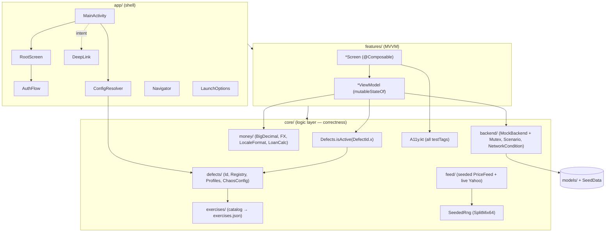
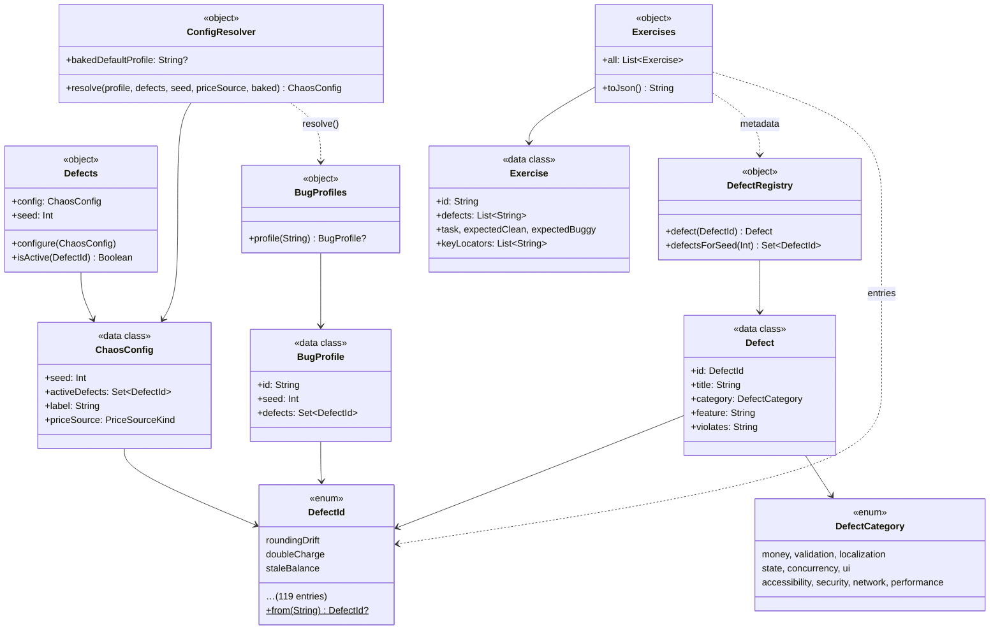
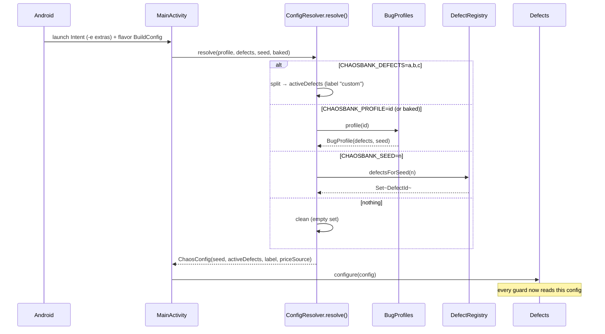
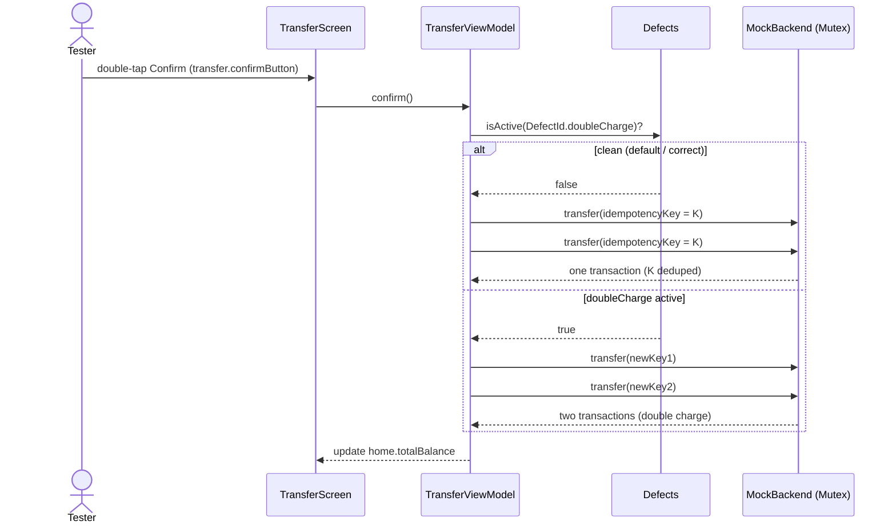
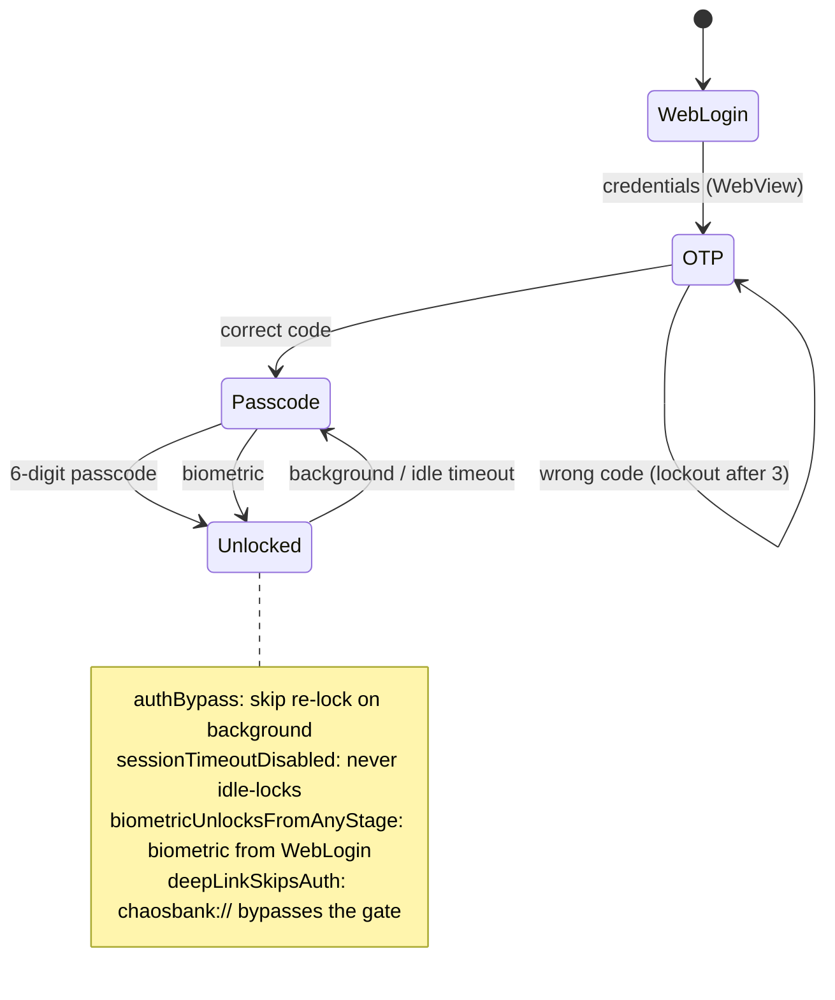
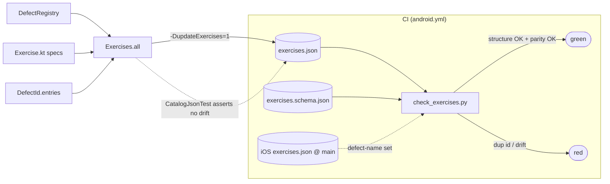

# ChaosBank-Android — UML Diagrams

Mermaid diagrams (render natively on GitHub). They complement
[ARCHITECTURE.md](ARCHITECTURE.md); the prose there is authoritative if the two ever
drift. This app is the 1:1 port of
[ChaosBank-iOS](https://github.com/VadimToptunov/ChaosBank-iOS), so these diagrams mirror
its structure with Kotlin/Compose types.

---

## 1. Package / layer diagram

The logic layer owns correctness; the UI layer only renders. Defects are injected in the
logic layer behind a single query surface.

---

## 2. Defect-system class diagram

How a defect is described, bundled, resolved, and surfaced to a guard.

---

## 3. Launch — config resolution

`ConfigResolver.resolve()` runs once at launch (`MainActivity`). Precedence: explicit
defects → profile → seed → baked flavor default → clean.

---

## 4. A guarded defect at runtime (`doubleCharge`)

The reference path is the `else`; the defect is a small isolated override. Locators are
unchanged either way, so the same test finds the same elements.

---

## 5. Auth ladder — state machine

The login → OTP → passcode → biometric ladder, plus background re-lock and idle timeout.
Several security defects short-circuit specific edges (annotated).

---

## 6. Exercise catalog + cross-platform parity pipeline

One source of truth (`Exercise.kt`) → `exercises.json`, drift-guarded by a unit test and
parity-checked in CI against the iOS sibling.

